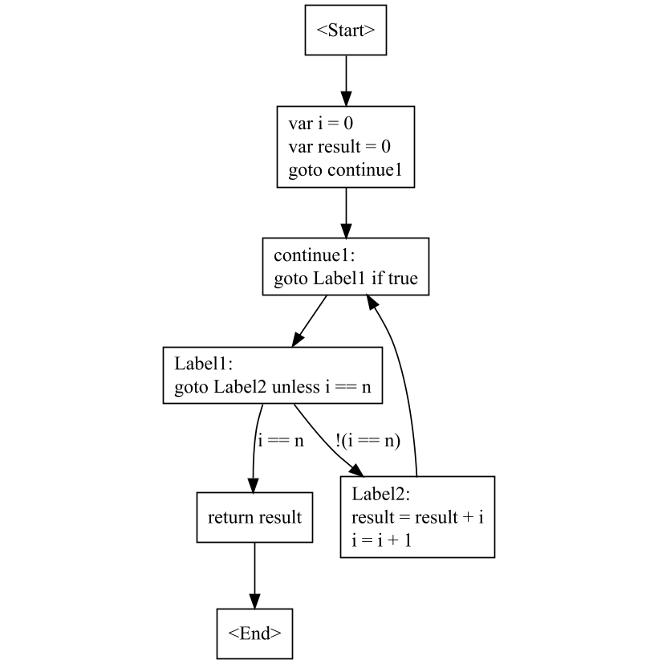

# Stage 1

## Completed items

* Basic REPL (read-eval-print loop) for an expression evaluator
* Implement a lexer, parser, and an evaluator.
* Support `+`, `-`, `*`, `/` operators.
* Print syntax trees.

When parsing the expression `1 + 2 * 3`, the ast like this:

```
└──BinaryExpression
    ├──NumberExpression
    │   └──NumberToken 1
    ├──PlusToken
    └──BinaryExpression
        ├──NumberExpression
        │   └──NumberToken 2
        ├──StarToken
        └──NumberExpression
            └──NumberToken 3
```

# Stage 2

## Completed items

* Generalized parsing using precedences
* Support unary operators, such as `+2` and `-3`
* Support for Boolean literals (`false`, `true`)
* Support for conditions such as `1 == 3 && 2 != 3 || true`
* Support for parenthesized expression, such as (true == false) && (false == false)
* Internal representation for type checking (`Binder`, and `BoundNode`)

### Bound Tree

The first version of the vm was walking the abstract syntax tree directly.
But the ast doesn't have any any *semantic* information. For Example, it doesn't
know which types an expression will be evaluating to, which leading to more
complicated features to impossible. The *bound tree* is created by
the Binder class by walking the ast and binding the nodes to symbolic information.
The binder represents the semantic analysis.

# Stage 3

## Completed items

* Extract compiler into a separate library
* Expose span on diagnostics that indicate where the error occurred
* Support for assignments and variable

### Compilation API

We have added a class called `Compilation` which holds onto the entire state of the
program. For now, it only provide an `Envaluate` API that will interpret the expression.

# Stage 4

## Completed items

* Added tests for lexing all tokens and their combinations
* Added tests for parsing unary and binary operators
* Added tests for evaluating

# Stage5

## Completed items

* Clean-up lexer, parser
* Added `SourceText`, which allow us to know token line number information.

# Stage6

## Completed items

* Add colorization to REPL
* Add compilation unit
* Add chaining to compilations
* Add statements
* Add variable declaration statements

### Scoping and shadowing ;

Logically, scopes are a tree and mirror the structure of the code, for example:

```
{
    var x = 10
    {
        var y = x * 2
        {
            var z = x * y
        }
        {
            var result = x + y
        }
    }
}
```

### Variable Declaration

```
var b = true // variable `b` 's type is boolean.

let a = 1
a = 2 // error, let keyword indicates that the variable is a read-only variable.
```

# Stage 7

## Completed items

* Make evaluation tests more declarative, especially for diagnostics
* Add support for `<,` `<=`, `>=`, and `>`
* Add support for if-statements
* Add support for while-statements
* Add support for for-statements
* Ensure parser doesn't loop infinitely on malformed block
* Ensure binder doesn't crash when binding fabricated identifiers

### If-statement

```
var a = 1
if a == 1:
    a = 10
else:
    a = 100

a  // output: 10
```

### While-statement

```
var i = 10
var result = 0
while i > 0:
{
    result = result + i
    i = i - 1
}

result          // output 55
```

### For-Statement

```
var result = 0
for i = 1 to 10
{
    result = result + i
}

result // output: 55

```

# Stage 8

## Completed items

* Add support for bitwise operators
* Add ability to output the bound tree
* Add ability to lower bound tree
* Lower `for`-statements into `while`-statements
* Print syntax and bound tree before evaluation
* Lower `if`, `while`, and `for` into gotos

### Lowering

Right now, the interpreter is directly executing the output of the binder. The
binder produces the bound tree, which is essentially an abstract syntax tree
with rich semantic information associated with each node in the tree.
It represents the semantic understanding of the program, such as the
symbols the names are bound to and the types of intermediary expressions.

Usually, this representation is as rich as the input language. That
characteristic is very useful as it allows exposing it to tooling, for example,
to produce code completion, tool tips, or even refactoring tools.

While it's possible to generate code directly out of this representation it's
not the most convenient approach. Many language constructs can be reduced, also
called *lowered*, to other constructs. That's because languages often provide
syntactic sugar that is merely a shorthand for other constructs. For example:

```
for i = 1 to 100
< statement >
```

is just a shorthand for this `while`-statement:

```
let i = 1
while i <= 100:
{
    <statement>
    i = i + 1
}
```

Instead of having to generate code for both, `for`- and `while`-statements, it's
easier to reduce `for` to `while`.

To do this, we're adding the concept of a `BoundTreeRewriter`. This class has
virtual methods for all nodes that can appear in the tree and allows derived
classes to replace specific nodes. Since our bound tree is immutable, the
replacement is happening in a bottom up fashion, which is relatively efficient
for immutable trees because it only requires to rewrite the spine of the tree
(i.e. all ancestors of the nodes that need to be replaced); all other parts of
the tree can be reused.

### Gotos

Actual processors -- or even virtual machines like the .NET runtime -- usually
don't have representation for `if` statements, or specific loops such as `for`
or `while`. Instead, they provide two primitives: *unconditional jumps* and
*conditional jumps*.

In order to make generating code easier, we've added representations for those:
`BoundGotoStatement` and `BoundConditionalGotoStatement`. In order to specify
the target of the jump, we need a representation for the label, for which we use
the new `LabelSymbol`, as well as a way to label a specific statement, for which
we use `BoundLabelStatement`. It's tempting to define the `BoundLabelStatement`
similar to how C# represents them in the syntax, which means that it references
a label and a statement but that's very inconvenient. Very often, we need a way
to create a label for whatever comes after the current node. However, since
nodes cannot navigate to their siblings, one usually cannot easily get "the
following" statement. The easiest way to solve this problem is by not
referencing a statement from `BoundLabelStatement` and simply have the semantics
that the label it references applies to the next statement.

With these primitives, it's pretty straightforward to replace the flow-control
elements.

# Stage9

## Completed items

We just improve the REPL, This includes the ability to edit multiple lines, have
history, and syntax highlighting.

# Stage10

## Completed items

* We added support for string literals and type symbols.

### String Literals

we now support strings like so:

```js
let hello = "Hello"
```

String need to be terminated on the same line(In other words, we don't support line breaks in them).
We also don't support any escape sequences yet (such as '\n', '\t'). However, supporting quotes
which are escaped by doubling them.

```
// output hello "World"!
let message = "Hello, ""World""!"
```

### Cascading errors

Expressions are generally bound inside-out. For example, in order to bind a
binary expression, one first binds the left hand side and right hand side in
order to know their types so that the operator can be resolved. This can lead to
cascading errors, like in this case:

```js
(10 * false) - 10
```

There is no `*` operator defined for `int` and `bool`, so the left hand side cannot be bound.
This makes it impossible to bind `-` operator as well. In general, as a developer, you don't want to drown in
error messages so a good compiler will try to avoid generating cascading errors.
For example, you don't want to generate two errors but only one for the above expression.
so that the `*` cannot be bound because that's the root cause.

In the past, we have returned the left hand side when a binary expression cannot be bound or fabricated a fake literal
expression with a value of `0`, this can lead to cascading error. To fix this problem, we have introduced an `ErrorType`
to indicate the absence of type information. we also add a `BoundErrorExpression` that is returned whenever we cannot
resolve an expression. This is handle a binary expression as follows:

```c#
private BoundExpression BindBinaryExpression(BinaryExpression syntax)
{
    var boundLeft     = BindExpression(syntax.Left);
    var boundRight    = BindExpression(syntax.Right);
    var boundOperator = BoundBinaryOperator.Bind(syntax.Operator.Kind, boundLeft.Type, boundRight.Type);

    if (boundLeft.Type == TypeSymbol.Error || boundRight.Type == TypeSymbol.Error)
        return new BoundErrorExpression();

    if (boundOperator != null)
        return new BoundBinaryExpression(boundLeft, boundOperator, boundRight);

    _diagnostics.ReportUndefinedBinaryOperator(syntax.Operator.Span,
                                               syntax.Operator.Text,
                                               boundLeft.Type,
                                               boundRight.Type);
                                                
    return new BoundErrorExpression();
}
```

# Stage 11

## Completed items

* We added support for calling built-in functions and convert between types.

### Separated syntax lists

When parsing call expressions, we need to represent the list of arguments.
So we have introduced a special kind of list we call `separater syntax list`.
so for code like

```
add(1, 2)
```

the separated list would contain the expression `1`, the comma, the expression `2`
Enumerating and indexing the list will generally skip the separators (so that `Arguments[1]` would
give you the second argument rather than the first comma), however, we have a method `GetSeparator(int index)` that
returns the associated token. For the last node it will return `null` because the last node doesn't have a trailing
comma.

# Stage 12

## Completed items

We added support for explicit typing of variables and function declarations.

### Functions

```
>> func hi(name: string) -> void
{
    // do something
}
```

### Forward declarations

Inside of the function is logically executing from top to bottom, or
more precisely from higher nodes in the tree to lower nodes in the tree.
In this situation, symbol must appear before use.

Some languages, such as C or C++, are designed to compile top to bottom in a single-pass,
which means developers cannot call functions or refer to global-variable unless then already
appeared in the file. To solve this problem, they allow forward declarations, where you basically
only write the signature and omit the function body.

In the hyper, we use multi-pass so that global-variable and functions can appear in any order.
We are doing this by first declaring all functions before binding function bodies.

### Stack Frame

The evaluator currently evaluates a single block. All variable are global so there is only
instance of them in the entire program, so having a single symbol-table that holds their value works.

In order to call functions, we need to have a way to let each function have their own instance
of their local variables.

In virtually all systems this achieved by using stack. Each time we call the function, a new
entry is pushed on the stack that represents the local state of the function, usually covering
the arguments as well as the local variables. This is called a *stack frame*. Each time you return
from a function. the top most stack is popped off that stack.

In hyper, we are doing the same thing:

1. When calling a function, a new set of locals is initialized. All parameters
   are added params to that new frame and that frame is pushed.
2. The function's body is identified and the statement is executed.
3. When the function is done, the frame is popped off.

This also required us to change how assign and look-up values for variables: by looking at
the symbol kind we identify whether it's a global, a local variable or parameter.
Global-Variables use the global dictionary while local variables and parameter use the current stack frame.

# Stage 13

### Completed items

* We added pretty printing for bound nodes as well as `break` and `continue`
  statements.

# Stage 14

### Completed items

* Added support for `return` statements and control flow analysis.

Implementing the `return` statement is so easy. What's harder is to decide whether
all control flows through a function end in the return statement.

Consider this code

```
func sum(n: int) -> int
{
    var i = 0
    var result = 0
    while true:
    {
        if (i == n) return result
        result = result + i
        i = i + 1
    }
 
    var z = 0
}
```

The statement `var z = 0` is unreachable. This is required more complex
control flow analysis to solve it.

All nodes in the graph are called `basic block`.A basic block is a list of statements
that are executed in sequence without any jumps. Only the first statement in a basic block
can be jumped to and only the last statement can transfer control to other blocks.
All edges in this graph represent branches in control flow.
All control flow graphs have a single <Start> and a single <End> node.

Thus, empty functions would have two nodes.
To check whether a function always returns a value, we only have to start at the
<End> node and check whether all incoming blocks end with a `return statement`,
ignoring blocks that are unreachable. A node is considered unreachable if
it doesn't have any incoming nodes or all incoming nodes are also considered unreachable.



# Stage 15

### Completed items

* Added support for multiple syntax trees in a single compilation.
* Added a compiler project `HyperC` which accepts the program paths.

# Stage 16

## Completed items

* Make meta commands attribute-driven
* Add `#help` that shows list of available meta commands
* Add `#load` that loads a script file into the REPL
* Add `#ls` that shows visible symbols
* Add `#dump` that shows the bound tree of a given function
* Persist submissions between run

# Stage 17

## Completed items

* Introduce `Compilation.IsScript` and use it to restrict expression statements
* Support implicit argument conversions when calling functions
* Add `any` type
* Lower global statements into `main` function

### Regular vs Script mode

In virtual All C-like languages, some expressions (such as assignment expressions and function call expressions) are
also allowed as standalone statements. The canonical examples are assignments and expressions:

```typescript
x = 10
print(string(x))
```

Syntactically, also allow for other expression such as

```
x + 1
```

Normally, these expressions are unmeaning because their values aren't observed.

```typescript
x + f(3)
```

But the top level binary-expression will produce a value that's not going anywhere, which is
most likely indicative that the developer made a mistake.
Hence, most c-like languages disallow or at lease warn when compiler encounter these expression.

However, when entering the REPL, these expression are useful. And their return value is observed by printing
it back to the console.

To differentiate between the two modes we're changing our `Compilation` to be in
either script mode or in regular mode:

* **regular mode** only assignment expressions and function call expressions are allowed as
  expression statements. Other expressions will be restricted or warned.

* **script mode** any expression is allowed as a global statement. But if the statement becomes part of a block,
  it will be treated as regular mode and subject to the same restrictions.

The two modes allow the language to balance between global interaction and regular programming. Script mode is used in
REPL and regular mode is used in other environments.

### Lowering global statements

We would like our logical model to be that all code is contained in a function.

For regular programs that are compiled that means we are expected to have a `main` function
where execution begins. `main` function take no arguments and returns no value(we also change later)

In script mode, we want a script function that take no arguments and returns `any` type.

* **Regular mode**. The developer can use global statements or explicitly
  declare a `main` function. When global statements are used, the compiler will
  synthesize a `main` function that will contain those statements. That's why
  using both global statements and a `main` function is illegal. Furthermore, we
  only allow one syntax tree to have global statements because unless we allow
  the developer to control the order of files, the execution order between them
  would be ill-defined.

* **Script mode**. The developer can declare a function called `main` in script
  mode but the function isn't treated specially and thus does not conflict with
  global statements. When global statements are used, they are put in a
  synthesized function with a name that the developer can't use (this avoids
  naming conflicts).

# Stage 18

## Completed items

* Add IL emitter
* Add MSBuild project file for Hello
* Replaced hard-coded IL emitter for Hello World by one that uses our
  intermediate representation
* Emit `input()` and variables
* Emit `string` concatenation
* Emit assignments
* Emit non-`void` functions and parameters
* Remove unnecessary references from compilation
* Expand implicit returns
* Emit conversions, unary expressions, and binary expressions
* Emit remaining statements
* Emit code for built-in rnd function

# Stage 19

## Completed items

* Try replaced the reflection code in `Node.GetChildren()` with the source generator

# Stage 20

## Completed items

* Perform constant folding
    - Emit constant values
    - Use constant values in evaluator

# Stage 21
## Completed items

* Add support for comment.